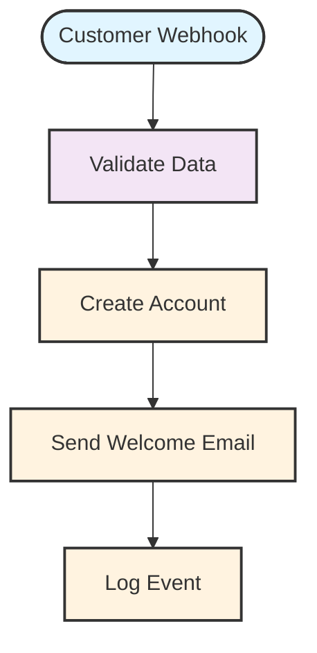

# Customer Onboarding Workflow

  

| Property | Value |
|----------|-------|
| **Version** | 1.0.0 |
| **Author** | Platform Team |
| **Organization** | Acme Corp |
| **Last Updated** | 2025-10-18 10:30:00 |
| **Status** | active |
| **Total Executions** | 1,247 |

## Description

This workflow automates the complete customer onboarding process, from initial webhook trigger to welcome email delivery. It validates customer data, creates accounts, and sends personalized welcome messages.

## Table of Contents

- [Overview](#overview)
- [Workflow Diagram](#workflow-diagram)
- [Statistics](#statistics)
- [Node Documentation](#node-documentation)
- [Variables](#variables)
- [Dependencies](#dependencies)
- [API Documentation](#api-documentation)
- [Workflow Structure](#workflow-structure)

## Overview

### Quick Summary

This workflow contains 5 nodes connected by 4 connections. The maximum depth is 5 levels.

### Tags

`customer` `onboarding` `automation` `email` `validation`

## Workflow Diagram



> **Note:** The diagram above shows the complete workflow structure with all nodes and connections.

## Statistics

### General

- **Total Nodes:** 5
- **Total Connections:** 4
- **Maximum Depth:** 5
- **Average Execution Time:** 342.50ms

### Node Distribution by Category

- **Actions:** 3 (60.0%)
- **Data Processing:** 1 (20.0%)
- **Triggers:** 1 (20.0%)

### Structure

- **Entry Points:** 1
- **Exit Points:** 1
- **Branches:** 0
- **Loops:** 0

## Node Documentation

### 1. Customer Webhook

| Property | Value |
|----------|-------|
| **ID** | `webhook-1` |
| **Type** | webhook |
| **Category** | Triggers |
| **Description** | Receives HTTP webhook requests |
| **Inputs** | 0 |
| **Outputs** | 1 |

**Configuration:**

```json
{
  "method": "POST",
  "path": "/customer/onboard",
  "authentication": {
    "type": "bearer",
    "required": true
  }
}
```

**Examples:**

<details>
<summary>Example Input</summary>

```json
{
  "email": "customer@example.com",
  "name": "John Doe",
  "company": "Acme Corp",
  "plan": "enterprise"
}
```
</details>

<details>
<summary>Example Output</summary>

```json
{
  "customerId": "cust_12345",
  "email": "customer@example.com",
  "name": "John Doe",
  "timestamp": "2025-10-18T10:30:00Z"
}
```
</details>

**Connections:**

*Outputs:*
- To: Validate Data

---

### 2. Validate Data

| Property | Value |
|----------|-------|
| **ID** | `validate-1` |
| **Type** | validate |
| **Category** | Data Processing |
| **Description** | Filters data based on conditions |
| **Inputs** | 1 |
| **Outputs** | 1 |

**Configuration:**

```json
{
  "schema": {
    "type": "object",
    "required": ["email", "name"],
    "properties": {
      "email": {
        "type": "string",
        "format": "email"
      },
      "name": {
        "type": "string",
        "minLength": 2
      },
      "company": {
        "type": "string"
      },
      "plan": {
        "type": "string",
        "enum": ["free", "pro", "enterprise"]
      }
    }
  }
}
```

**Connections:**

*Inputs:*
- From: Customer Webhook

*Outputs:*
- To: Create Account

---

### 3. Create Account

| Property | Value |
|----------|-------|
| **ID** | `create-account-1` |
| **Type** | database |
| **Category** | Actions |
| **Description** | Transforms data structure |
| **Inputs** | 1 |
| **Outputs** | 1 |

**Configuration:**

```json
{
  "operation": "insert",
  "table": "customers",
  "data": {
    "email": "{{email}}",
    "name": "{{name}}",
    "company": "{{company}}",
    "plan": "{{plan}}",
    "status": "active",
    "created_at": "{{now}}"
  }
}
```

**Connections:**

*Inputs:*
- From: Validate Data

*Outputs:*
- To: Send Welcome Email

---

### 4. Send Welcome Email

| Property | Value |
|----------|-------|
| **ID** | `send-email-1` |
| **Type** | email |
| **Category** | Actions |
| **Description** | Sends email messages |
| **Inputs** | 1 |
| **Outputs** | 1 |

**Configuration:**

```json
{
  "to": "{{email}}",
  "from": "onboarding@acme.com",
  "subject": "Welcome to Acme Corp!",
  "template": "welcome-email",
  "variables": {
    "customerName": "{{name}}",
    "plan": "{{plan}}"
  }
}
```

**Connections:**

*Inputs:*
- From: Create Account

*Outputs:*
- To: Log Event

> **Note:** Uses the 'welcome-email' template with personalized variables

---

### 5. Log Event

| Property | Value |
|----------|-------|
| **ID** | `log-1` |
| **Type** | log |
| **Category** | Actions |
| **Inputs** | 1 |
| **Outputs** | 0 |

**Configuration:**

```json
{
  "level": "info",
  "message": "Customer onboarding completed",
  "metadata": {
    "customerId": "{{customerId}}",
    "email": "{{email}}",
    "timestamp": "{{now}}"
  }
}
```

**Connections:**

*Inputs:*
- From: Send Welcome Email

---

## Variables

| Variable | Type | Scope | Description | Used In |
|----------|------|-------|-------------|---------|
| `email` | string | workflow | Customer email address | Validate Data, Create Account, Send Welcome Email, Log Event |
| `name` | string | workflow | Customer full name | Create Account, Send Welcome Email |
| `company` | string | workflow | Customer company name | Create Account |
| `plan` | string | workflow | Selected subscription plan | Create Account, Send Welcome Email |
| `customerId` | string | workflow | Generated customer ID | Log Event |
| `now` | string | workflow | Current timestamp | Create Account, Log Event |

## Dependencies

### Credentials

- `email-smtp-credentials`
- `database-connection`

### Integrations

- email
- database

### Sub-Workflows

*This workflow has no sub-workflow dependencies.*

## API Documentation

This workflow exposes the following webhook endpoints:

### Customer Webhook

```http
POST /customer/onboard
```

Receives HTTP webhook requests for customer onboarding

**Request Body:**

```json
{
  "email": "customer@example.com",
  "name": "John Doe",
  "company": "Acme Corp",
  "plan": "enterprise"
}
```

**Response:**

```json
{
  "customerId": "cust_12345",
  "email": "customer@example.com",
  "name": "John Doe",
  "timestamp": "2025-10-18T10:30:00Z"
}
```

---

## Workflow Structure

### Entry Points

- **Customer Webhook** (`webhook-1`)

### Exit Points

- **Log Event** (`log-1`)

### Conditional Branches

*No conditional branches in this workflow.*

### Loops

*No loops in this workflow.*

---

*This documentation was automatically generated by Visual Documentation Generator v1.0.0*
