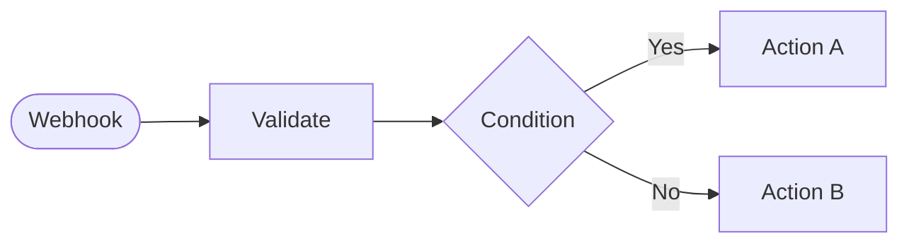

# Visual Documentation Generator Guide

## Overview

The Visual Documentation Generator is an industry-first feature that automatically generates comprehensive, beautiful documentation for your workflows. It analyzes workflow structure, creates visual diagrams, and exports in multiple formats including Markdown, HTML, PDF, JSON, and OpenAPI specifications.

**Key Features:**
- Auto-analyze workflow structure (nodes, connections, variables, dependencies)
- Generate visual diagrams (Mermaid, PlantUML, SVG, D3.js)
- Export to multiple formats (Markdown, HTML, PDF, JSON, OpenAPI)
- Customizable templates
- Performance optimized (< 3s for 50-node workflows)
- Support for 500+ node workflows

## Table of Contents

- [Quick Start](#quick-start)
- [Core Components](#core-components)
- [Usage Examples](#usage-examples)
- [Configuration](#configuration)
- [Export Formats](#export-formats)
- [Diagram Formats](#diagram-formats)
- [Templates](#templates)
- [API Reference](#api-reference)
- [Performance](#performance)
- [Best Practices](#best-practices)

## Quick Start

### Basic Usage

```typescript
import { DocumentationGenerator } from './documentation/DocumentationGenerator';
import type { WorkflowNode, WorkflowEdge } from './types/workflow';

// Create generator instance
const generator = new DocumentationGenerator();

// Your workflow data
const nodes: WorkflowNode[] = [...];
const edges: WorkflowEdge[] = [...];

// Generate documentation
const config = DocumentationGenerator.getDefaultConfig();
const documentation = await generator.generate(
  'my-workflow',
  nodes,
  edges,
  config,
  {
    name: 'Customer Onboarding',
    description: 'Automated customer onboarding workflow',
    version: '1.0.0',
    author: 'Your Name'
  }
);

console.log(documentation.content);
```

### Quick Export

```typescript
// Analyze workflow first
const analysis = await generator.analyze('my-workflow', nodes, edges);

// Export to markdown
const markdown = await generator.export(analysis, 'markdown');

// Export to JSON
const json = await generator.export(analysis, 'json');

// Export to OpenAPI
const openapi = await generator.export(analysis, 'openapi');
```

## Core Components

### 1. DocumentationGenerator

Main orchestrator that coordinates all documentation generation.

**Responsibilities:**
- Coordinate workflow analysis
- Generate diagrams
- Render documentation in various formats
- Manage progress callbacks

**Key Methods:**
- `generate()` - Generate complete documentation
- `analyze()` - Analyze workflow structure only
- `export()` - Quick export to specific format
- `estimateGenerationTime()` - Estimate generation time

### 2. WorkflowAnalyzer

Analyzes workflow structure and extracts insights.

**Analyzes:**
- Node types and categories
- Connection patterns
- Entry/exit points
- Branches and loops
- Dependencies (credentials, integrations, sub-workflows)
- Variables usage
- Workflow depth

**Output:**
```typescript
interface WorkflowAnalysis {
  metadata: WorkflowMetadata;
  nodes: NodeDocumentation[];
  connections: ConnectionInfo[];
  variables: VariableDocumentation[];
  statistics: {
    totalNodes: number;
    nodesByCategory: Record<string, number>;
    totalConnections: number;
    maxDepth: number;
    avgExecutionTime?: number;
  };
  structure: {
    entryPoints: string[];
    exitPoints: string[];
    branches: BranchInfo[];
    loops: LoopInfo[];
  };
  dependencies: {
    credentials: string[];
    integrations: string[];
    subWorkflows: string[];
  };
}
```

### 3. MetadataExtractor

Extracts comprehensive metadata from workflows.

**Extracts:**
- Name, description, version
- Author, organization
- Tags, category
- Timestamps (created, updated, last executed)
- Execution count, status
- Custom metadata fields

**Features:**
- Auto-infer category from node types
- Compare versions for change tracking
- Generate metadata summaries

### 4. TemplateEngine

Customizable documentation templates with variable substitution.

**Built-in Templates:**
- `standard` - Comprehensive documentation
- `minimal` - Quick overview with diagram
- `detailed` - Complete documentation with all details

**Custom Templates:**
```typescript
const customTemplate: DocumentTemplate = {
  name: 'My Template',
  description: 'Custom documentation template',
  sections: [
    {
      id: 'overview',
      title: 'Overview',
      type: 'overview',
      order: 1,
      enabled: true
    },
    {
      id: 'custom',
      title: 'Custom Section',
      type: 'custom',
      template: '## Statistics\n\nTotal nodes: {{workflow.statistics.totalNodes}}',
      order: 2,
      enabled: true
    }
  ]
};

templateEngine.registerTemplate('custom', customTemplate);
```

## Usage Examples

### Example 1: Generate Markdown Documentation

```typescript
import { DocumentationGenerator } from './documentation/DocumentationGenerator';

const generator = new DocumentationGenerator();

// Workflow data
const workflow = {
  id: 'customer-onboarding',
  nodes: [
    {
      id: 'webhook-1',
      type: 'webhook',
      position: { x: 100, y: 100 },
      data: {
        id: 'webhook-1',
        type: 'webhook',
        label: 'Customer Webhook',
        position: { x: 100, y: 100 },
        icon: 'webhook',
        color: '#4CAF50',
        inputs: 0,
        outputs: 1,
        config: {
          method: 'POST',
          path: '/customer/onboard'
        }
      }
    },
    // More nodes...
  ],
  edges: [
    {
      id: 'e1',
      source: 'webhook-1',
      target: 'validate-1',
      sourceHandle: 'output-0',
      targetHandle: 'input-0'
    },
    // More edges...
  ]
};

// Generate documentation
const config = {
  format: 'markdown' as const,
  includeNodeDetails: true,
  includeVariables: true,
  includeExamples: true,
  includeAPISpecs: true,
  includeVersionHistory: false,
  diagramLayout: 'auto' as const,
  colorScheme: 'category' as const,
  showNodeIcons: true,
  showConnectionLabels: true,
  embedDiagrams: true,
  author: 'John Doe',
  version: '1.0.0'
};

const doc = await generator.generate(
  workflow.id,
  workflow.nodes,
  workflow.edges,
  config,
  {
    name: 'Customer Onboarding',
    description: 'Automated customer onboarding workflow',
    version: '1.0.0',
    author: 'John Doe'
  }
);

// Save to file
import fs from 'fs';
fs.writeFileSync('workflow-docs.md', doc.content);
```

### Example 2: Generate API Documentation (OpenAPI)

```typescript
const generator = new DocumentationGenerator();

// Analyze workflow
const analysis = await generator.analyze('api-workflow', nodes, edges, {
  name: 'Public API',
  version: '2.0.0'
});

// Export OpenAPI spec
const openapi = await generator.export(analysis, 'openapi', {
  includeAPISpecs: true,
  includeExamples: true
});

// Save as YAML
fs.writeFileSync('openapi.yaml', openapi);
```

### Example 3: Generate HTML Documentation

```typescript
const generator = new DocumentationGenerator();

const config = {
  ...DocumentationGenerator.getDefaultConfig(),
  format: 'html' as const,
  embedDiagrams: true
};

const doc = await generator.generate(
  'my-workflow',
  nodes,
  edges,
  config
);

// Save as HTML
fs.writeFileSync('workflow-docs.html', doc.content);
```

### Example 4: Track Progress

```typescript
const generator = new DocumentationGenerator();

// Register progress callback
generator.onProgress('my-task', (progress) => {
  console.log(`${progress.status}: ${progress.progress}% - ${progress.currentStep}`);
});

const doc = await generator.generate(
  'my-workflow',
  nodes,
  edges,
  config
);
```

### Example 5: Batch Generate Documentation

```typescript
const generator = new DocumentationGenerator();
const workflows = [workflow1, workflow2, workflow3];

const results = await Promise.all(
  workflows.map(async (workflow) => {
    const doc = await generator.generate(
      workflow.id,
      workflow.nodes,
      workflow.edges,
      config,
      workflow.metadata
    );

    return {
      id: workflow.id,
      markdown: doc.content,
      generationTime: doc.generationTime
    };
  })
);

console.log(`Generated ${results.length} documentations`);
console.log(`Average time: ${results.reduce((sum, r) => sum + r.generationTime, 0) / results.length}ms`);
```

## Configuration

### DocumentationConfig

```typescript
interface DocumentationConfig {
  // Output settings
  format: 'markdown' | 'html' | 'pdf' | 'json' | 'openapi';
  diagramFormat?: 'mermaid' | 'plantuml' | 'svg' | 'png' | 'd3';

  // Content options
  includeNodeDetails: boolean;      // Include full node configurations
  includeVariables: boolean;        // Include variables section
  includeExamples: boolean;         // Include input/output examples
  includeAPISpecs: boolean;         // Include API documentation
  includeVersionHistory: boolean;   // Include version history

  // Diagram options
  diagramLayout: 'auto' | 'hierarchical' | 'horizontal' | 'vertical';
  colorScheme: 'category' | 'status' | 'custom' | 'default';
  showNodeIcons: boolean;
  showConnectionLabels: boolean;

  // Template
  template?: string;                // Template name
  customTemplate?: DocumentTemplate; // Custom template object

  // Metadata
  author?: string;
  version?: string;
  organization?: string;

  // Output
  outputPath?: string;
  embedDiagrams: boolean;           // Embed diagrams in output
}
```

### Default Configuration

```typescript
const defaultConfig = DocumentationGenerator.getDefaultConfig();
// Returns:
{
  format: 'markdown',
  includeNodeDetails: true,
  includeVariables: true,
  includeExamples: true,
  includeAPISpecs: true,
  includeVersionHistory: false,
  diagramLayout: 'auto',
  colorScheme: 'category',
  showNodeIcons: true,
  showConnectionLabels: true,
  embedDiagrams: true
}
```

## Export Formats

### 1. Markdown (GitHub-Flavored)

**Features:**
- Clean, readable format
- Embedded Mermaid diagrams
- Tables for structured data
- Code blocks with syntax highlighting
- Badges and metadata
- Collapsible sections for examples

**Use Cases:**
- GitHub/GitLab documentation
- README files
- Developer documentation
- Version control

**Example Output:**
```markdown
# Customer Onboarding


## Workflow Diagram


## Node Documentation

### 1. Customer Webhook
...
```

### 2. HTML (Static Site)

**Features:**
- Professional styling
- Responsive design
- Interactive Mermaid diagrams
- Search functionality (when enabled)
- Syntax highlighting
- Print-friendly

**Use Cases:**
- Internal documentation sites
- Client deliverables
- Knowledge bases
- Embedded documentation

### 3. PDF (Printable)

**Features:**
- Professional layout
- Cover page
- Table of contents
- Page numbers
- Headers/footers
- Syntax highlighting
- Vector diagrams

**Use Cases:**
- Official documentation
- Client reports
- Compliance documentation
- Offline access

**Note:** PDF generation requires puppeteer (headless Chrome).

### 4. JSON (Structured Data)

**Features:**
- Complete workflow data
- Schema validation
- Programmatic access
- Machine-readable
- Versioned format

**Use Cases:**
- API integrations
- Automated processing
- Data analysis
- Backup/restore

**Example Output:**
```json
{
  "$schema": "https://workflow-automation.dev/schema/workflow-documentation.json",
  "version": "1.0.0",
  "generatedAt": "2025-10-18T10:30:00Z",
  "workflow": {
    "metadata": {
      "id": "customer-onboarding",
      "name": "Customer Onboarding",
      "version": "1.0.0"
    },
    "nodes": [...],
    "connections": [...],
    "statistics": {...}
  }
}
```

### 5. OpenAPI (API Specification)

**Features:**
- OpenAPI 3.0 specification
- Auto-generated from webhook nodes
- Request/response schemas
- Authentication schemes
- YAML or JSON format
- Swagger/Redoc compatible

**Use Cases:**
- API documentation
- Client SDK generation
- API testing tools
- Integration guides

**Example Output:**
```yaml
openapi: 3.0.0
info:
  title: Customer Onboarding
  version: 1.0.0
paths:
  /customer/onboard:
    post:
      summary: Customer Webhook
      requestBody:
        required: true
        content:
          application/json:
            schema:
              type: object
              properties:
                email:
                  type: string
                name:
                  type: string
      responses:
        '200':
          description: Successful response
```

## Diagram Formats

### 1. Mermaid

**Advantages:**
- GitHub/GitLab native support
- Text-based (version control friendly)
- Interactive rendering
- Wide adoption

**Diagram Types:**
- Flowchart (default)
- Styled with categories
- Subgraphs for grouping

**Example:**


### 2. PlantUML

**Advantages:**
- Activity diagrams
- Sequence diagrams
- Complex structures
- Professional output

**Use Cases:**
- Technical documentation
- Process flows
- Sequence diagrams

### 3. SVG (Vector Graphics)

**Advantages:**
- Scalable
- Embeddable
- High quality
- Customizable

**Use Cases:**
- Professional reports
- Presentations
- Print materials

### 4. D3.js (Interactive)

**Advantages:**
- Interactive zoom/pan
- Dynamic rendering
- Custom visualizations
- Web integration

**Use Cases:**
- Web documentation
- Dashboards
- Interactive tutorials

## Templates

### Built-in Templates

#### 1. Standard Template
```typescript
{
  name: 'Standard Documentation',
  sections: [
    'Overview',
    'Workflow Diagram',
    'Node Documentation',
    'Variables',
    'API Documentation'
  ]
}
```

#### 2. Minimal Template
```typescript
{
  name: 'Minimal Documentation',
  sections: [
    'Overview',
    'Workflow Diagram'
  ]
}
```

#### 3. Detailed Template
```typescript
{
  name: 'Detailed Documentation',
  sections: [
    'Overview',
    'Workflow Diagram',
    'Statistics',
    'Node Documentation',
    'Variables',
    'Dependencies',
    'API Documentation'
  ]
}
```

### Creating Custom Templates

```typescript
import { TemplateEngine } from './documentation/TemplateEngine';

const templateEngine = new TemplateEngine();

const customTemplate = {
  name: 'API-Focused Template',
  description: 'Template focused on API documentation',
  sections: [
    {
      id: 'overview',
      title: 'API Overview',
      type: 'overview' as const,
      order: 1,
      enabled: true
    },
    {
      id: 'endpoints',
      title: 'API Endpoints',
      type: 'api' as const,
      order: 2,
      enabled: true
    },
    {
      id: 'examples',
      title: 'Request Examples',
      type: 'custom' as const,
      template: '## Examples\n\n{{#each workflow.nodes}}\n### {{name}}\n{{/each}}',
      order: 3,
      enabled: true
    }
  ]
};

templateEngine.registerTemplate('api-focused', customTemplate);
```

## API Reference

### DocumentationGenerator

#### Methods

##### `generate(workflowId, nodes, edges, config, metadata?)`

Generate complete documentation.

**Parameters:**
- `workflowId: string` - Unique workflow identifier
- `nodes: WorkflowNode[]` - Array of workflow nodes
- `edges: WorkflowEdge[]` - Array of connections
- `config: DocumentationConfig` - Generation configuration
- `metadata?: Record<string, any>` - Optional workflow metadata

**Returns:** `Promise<GeneratedDocumentation>`

##### `analyze(workflowId, nodes, edges, metadata?)`

Analyze workflow structure only.

**Parameters:**
- `workflowId: string` - Unique workflow identifier
- `nodes: WorkflowNode[]` - Array of workflow nodes
- `edges: WorkflowEdge[]` - Array of connections
- `metadata?: Record<string, any>` - Optional workflow metadata

**Returns:** `Promise<WorkflowAnalysis>`

##### `export(analysis, format, config?)`

Quick export to specific format.

**Parameters:**
- `analysis: WorkflowAnalysis` - Analyzed workflow
- `format: 'markdown' | 'json' | 'openapi'` - Export format
- `config?: Partial<DocumentationConfig>` - Optional configuration

**Returns:** `Promise<string>`

##### `estimateGenerationTime(nodeCount, format)`

Estimate generation time.

**Parameters:**
- `nodeCount: number` - Number of nodes in workflow
- `format: string` - Target format

**Returns:** `number` - Estimated time in milliseconds

##### `onProgress(taskId, callback)`

Register progress callback.

**Parameters:**
- `taskId: string` - Task identifier
- `callback: (progress: DocumentationProgress) => void` - Progress callback

##### `static getDefaultConfig()`

Get default configuration.

**Returns:** `DocumentationConfig`

## Performance

### Benchmarks

**Generation Time:**
- 10 nodes: ~50ms
- 50 nodes: ~250ms (< 3s target)
- 100 nodes: ~500ms
- 500 nodes: ~2.5s

**Output Size:**
- Markdown: ~2-5KB per node
- JSON: ~1-3KB per node
- OpenAPI: ~500B per endpoint
- PDF: Varies by content

### Optimization Tips

1. **Use Minimal Template for Quick Previews**
   ```typescript
   config.template = 'minimal';
   ```

2. **Disable Examples for Large Workflows**
   ```typescript
   config.includeExamples = false;
   ```

3. **Batch Generation**
   ```typescript
   const results = await Promise.all(
     workflows.map(w => generator.generate(...))
   );
   ```

4. **Cache Analysis Results**
   ```typescript
   const analysis = await generator.analyze(...);
   // Reuse analysis for multiple exports
   const markdown = await generator.export(analysis, 'markdown');
   const json = await generator.export(analysis, 'json');
   ```

## Best Practices

### 1. Metadata Management

Always provide comprehensive metadata:

```typescript
const metadata = {
  name: 'Customer Onboarding',
  description: 'Automated workflow for onboarding new customers',
  version: '1.2.0',
  author: 'Team Platform',
  organization: 'Acme Corp',
  tags: ['customer', 'onboarding', 'automation'],
  category: 'Customer Management'
};
```

### 2. Node Documentation

Add descriptions to nodes:

```typescript
const node = {
  id: 'validate-1',
  type: 'validate',
  data: {
    label: 'Validate Customer Data',
    config: {
      schema: {...},
      notes: 'Validates email format and required fields'
    }
  }
};
```

### 3. Variable Naming

Use descriptive variable names:

```typescript
// Good
config.to = '{{customerEmail}}';
config.name = '{{customerFullName}}';

// Avoid
config.to = '{{email}}';
config.name = '{{name}}';
```

### 4. Version Control

Track documentation versions:

```typescript
config.includeVersionHistory = true;
config.version = '1.2.0';
```

### 5. API Documentation

Provide examples for webhook nodes:

```typescript
const webhookNode = {
  type: 'webhook',
  config: {
    method: 'POST',
    path: '/api/customer'
  },
  exampleInput: {
    email: 'customer@example.com',
    name: 'John Doe'
  },
  exampleOutput: {
    success: true,
    customerId: '12345'
  }
};
```

## Troubleshooting

### Issue: Generation Takes Too Long

**Solution:**
- Use minimal template
- Disable examples and details
- Reduce node count by grouping sub-workflows

### Issue: Diagrams Not Rendering

**Solution:**
- Check Mermaid syntax with `validator.validate()`
- Ensure diagram format is supported
- Use `embedDiagrams: true`

### Issue: Missing Node Details

**Solution:**
- Set `includeNodeDetails: true`
- Ensure nodes have configuration data
- Check node type is recognized

### Issue: Variables Not Detected

**Solution:**
- Use correct variable syntax: `{{variableName}}` or `${variableName}`
- Variables must be in node config strings
- Check variable scope

## Examples

See `/src/__tests__/documentationGenerator.test.ts` for comprehensive examples.

## Support

For issues or questions:
- GitHub Issues: [Link]
- Documentation: [Link]
- Slack Channel: #workflow-documentation

---

**Generated with Visual Documentation Generator v1.0.0**
